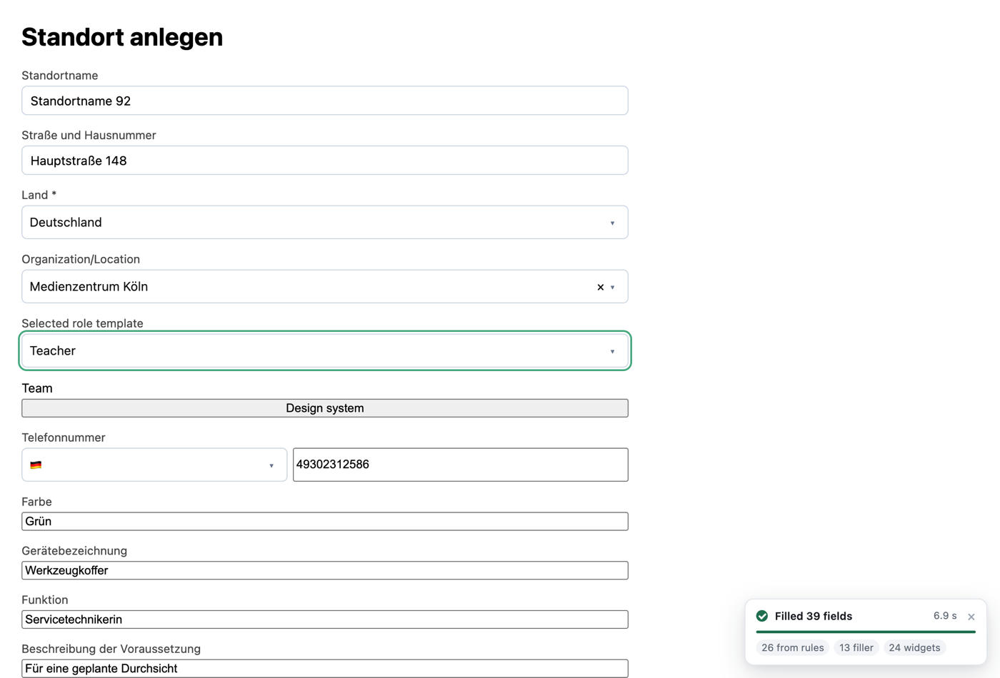
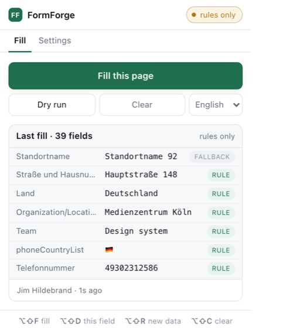

<div align="center">

# FormForge

### One click fills the entire form — including the custom dropdowns, date pickers, rich-text editors, and file uploads that ordinary form fillers cannot touch.

Built for QA engineers who fill the same create-form forty times a day.

[](manifest.json)
[](package.json)
[](#development)
[](#the-model-is-optional-and-never-in-the-way)
[](LICENSE)



</div>

---

## Why another form filler

Most form fillers assign `input.value` and dispatch a `change` event. That works on a plain `<input>` and
does nothing at all on the controls modern admin panels are actually built from: a PrimeVue `Select` is a `<div>`
that opens a teleported overlay, a date picker refuses typed text, a Quill editor ignores anything that is not a
real `beforeinput`. So you fill the six text boxes by machine and the fourteen interesting fields by hand.

FormForge drives the control the way a person does, then reads it back to see whether the page kept it.

|                               | A `.value =` form filler                   | FormForge                                                                                              |
|-------------------------------|--------------------------------------------|--------------------------------------------------------------------------------------------------------|
| `<input>`, `<select>`, radios | yes                                        | yes                                                                                                    |
| Component-library dropdowns   | the component reverts the write            | opens the real popup, picks a real option, waits for the list if it comes from a server                |
| Date & time pickers           | typed text the component rejects           | clicks a day in the panel, or types in the locale's format; drives a time picker's spinners            |
| Rich-text editors             | plain text, or nothing                     | real markup through the editor's own input events                                                      |
| File inputs                   | skipped                                    | a PNG, PDF, CSV or JSON generated in the page to match the input's `accept`                            |
| The data                      | random, field by field                     | one invented person per fill: the email matches the name, the postcode the city, the phone the country |
| IBAN / VAT id / card number   | fail their checksums                       | pass                                                                                                   |
| Result                        | tells you what it typed                    | tells you what the control **holds afterwards**, and names what did not stick                          |
| AI                            | a cloud API, an account and a subscription | Chrome's built-in on-device model, optional, and never able to delay a fill                            |
| Your data                     | leaves the browser                         | never leaves the browser unless you add your own API key                                               |

## What one press does

- **Finds every fillable control.** Native inputs, `<select>`, radio groups, checkboxes, file inputs,
  `contenteditable` — and widgets from **PrimeVue, MUI, Ant Design, react-select, Radix, Headless UI,
  Choices.js, Select2, Tom Select and vue-multiselect**, plus anything that merely speaks ARIA (`role="combobox"` with
  `role="option"`). An unknown library still works if it is accessible.
- **Invents one coherent person.** Not forty unrelated strings: `anna.becker+tv6cbv@example.com` belongs to Anna
  Becker, who lives at a Cologne postcode and answers a Cologne phone number. Dates come out in the locale's
  format and a *return* date lands after the *rental* date.
- **Respects the control.** Values are clamped to `min`, `max`, `step`, `maxlength` and `pattern`. A dropdown only
  ever receives one of its own options. A required field is never left empty — if nothing matches, it takes a valid
  option and says so.
- **Checks its own work.** Every control is read back after writing. Anything a framework silently reverted is
  written again; fields that only appeared *because* of the fill (a switch that reveals three more inputs) are
  filled too; and a maximum that exists only in a validation schema is read off the error message under the field
  and obeyed.
- **Says what went wrong.** A card in the corner reports how many fields were filled, how many came from rules,
  from the model, or were left empty — and which ones. There is a **Copy for bug report** button underneath.

<div align="center">

</div>

## Install

1. Clone this repository.
2. Open `chrome://extensions`, turn on **Developer mode**, choose **Load unpacked** and pick the folder.

Chrome 128 or later. Nothing to build, nothing to install, no account to create.

## Use

| How                                                         | What                                                                           |
|-------------------------------------------------------------|--------------------------------------------------------------------------------|
| Toolbar popup → **Fill this page**                          | Fills the form, then shows what went where and why                             |
| Popup → **Dry run**                                         | Lists every control it would fill and which adapter claimed it; writes nothing |
| Popup → **Clear**                                           | Empties what FormForge filled                                                  |
| `Alt+Shift+F` / `R` / `C`                                   | Fill · fill again with a new person · clear                                    |
| `Alt+Shift+D`                                               | Fill only the field the cursor is in; press again for a different value        |
| Right-click → **Fill this page** / **Fill just this field** | The whole form, or the one control under the pointer                           |

Chrome binds these keys at install time. If one does nothing (on a Mac, `Alt+Shift+D` types `Î` into the page
instead), the popup footer says which shortcut is unassigned and links to `chrome://extensions/shortcuts`.

## How a value is chosen

For each field, in order — the first step that answers wins:

1. **Rule** — an ordered list of `[pattern, persona => value]` in [`src/generator.js`](src/generator.js), matched
   against the field's label, name, id, and placeholder. `zip` → a postcode, `iban` → a valid IBAN, `country` → the
   persona's country tried against the dropdown's real options, under every spelling that country has.
2. **Type default** — whatever the control's kind implies: a number, a date in the locale's format, a time, prose,
   markup for a rich-text editor.
3. **Model** — everything left over goes to Chrome's built-in Gemini Nano in one batch, with the persona and the
   page's own heading, so the answers stay coherent with each other and with the rest of the form.
4. **Filler** — text named after the field (`Prerequisite 43`), or a seeded pick among the control's real options.

Everything derives from a seed, so a fill is reproducible: pin one in **Settings → Repeat data** to get the same
person twice, which is what you want when you are reproducing a bug rather than finding one.

## Speed

The fill does not wait for the model. The request goes out as soon as the form has been read, and FormForge
starts writing everything the rules already know while it is in flight; a field the model owns is written the
moment its answer lands, and only what is *still* outstanding when the form runs out of fields is waited for.

One run of `npm run audit` against a real device-management form behind a login — 24 fields, 16 of them
component-library widgets:

```
collect        15 ms   reading the form
model           1 ms   time the fill actually spent waiting for the model
firstPass    2041 ms   driving 24 controls
recollect       7 ms   looking again for what the fill revealed
secondPass     32 ms   re-checking, and writing what it found
total        2089 ms
```

`model` is the only number the model can inflate, and it is the time the fill *blocked*, not the time the model
took. In the test suite, a stand-in that needs two and a half seconds to answer costs a fill zero milliseconds —
the form is being written while it thinks — and the Debug tab reports both numbers so the two are never confused.

Every wait in the code is a condition with a budget, never a fixed sleep: a list that arrives at once is not paid
for as though it arrived slowly.

## The model is optional, and never in the way

- **On-device by default.** Chrome's built-in Gemini Nano runs locally — no key, no account, and after its one-time
  download, no network either. Without it the rules still fill every recognised field.
- **Bounded, always.** Bringing the model into memory, downloading it, and answering each have their own budget. A
  missing, slow, or wedged model changes how good the values are, never whether they arrive.
- **Your own key, if you want one.** Anthropic, OpenAI, or Gemini, used only for the fields the on-device model
  could not answer. *On-device only* keeps everything offline; *key only* skips Nano. **Test this setup** makes one
  real request through whatever is configured and shows the provider's own answer — or its own error text.

## Privacy and permissions

| Permission               | Why                                                                                                                                      |
|--------------------------|------------------------------------------------------------------------------------------------------------------------------------------|
| `activeTab`, `scripting` | The filler is injected into the tab **only** when you press Fill. It is not a declared content script and does not run while you browse. |
| `storage`                | Your settings, the last fill's decision trail, and an API key if you enter one. All local to this browser profile.                       |
| `contextMenus`           | The right-click entries.                                                                                                                 |
| `<all_urls>`             | A tester's form can be on any host, and the extension cannot know which in advance.                                                      |

Rules and the on-device model run entirely in your browser. Field labels reach a hosted provider only if you enter
an API key, and then only the labels and limits of the fields no rule could answer — never the values already on
the page. Uploaded files are generated in the page; nothing is fetched. Phone numbers come from ranges reserved
for fiction (US `555-01xx`, DE `23125 xxx`) and card numbers are the `4111 11…` test family.

## Extending it

**A new rule** is one line in `RULES` in [`src/generator.js`](src/generator.js) — specific patterns above general
ones. Return an array to offer a dropdown several candidates:

```js
[/\b(manufacturer|hersteller|brand|marke)\b/i, p => p.company, WEAK],
```

A rule tagged `WEAK` is a floor rather than an answer: the field is also offered to the model, and the rule fills
it only if the model does not.

**A new widget library** is one entry in `LIBS` in [`src/adapters.js`](src/adapters.js). Only `root` and `kind` are
required; the rest are hints with generic ARIA fallbacks. Make `root` specific enough that an application's own
wrapper class cannot match it:

```js
{
    id: 'acme-select', kind
:
    'choice',
        root
:
    '.acme-select:has(> .acme-select__trigger)',
        label
:
    '.acme-select__value', option
:
    '[role="option"]',
        overlay
:
    '.acme-select__panel', filter
:
    '.acme-select__search'
}
,
```

## Development

```
src/
  dom.js         clicks, typing, waiting — knows nothing about forms
  vocab.js       word lists (generated from faker by `npm run vocab`)
  generator.js   seed → persona → rules → checksums
  adapters.js    which control is which, and what it is called
  overlays.js    finding, opening and closing a widget's popup
  fillers.js     how to drive each kind of control
  uploads.js     generated files for <input type="file">
  hud.js         the on-page progress card
  content.js     discovery, planning, the fill loop, repair
  background.js  service worker: the model, the injected file list, shortcuts, menus
  popup.*        the toolbar popup
test/            four suites and two fixtures
tools/           audit.mjs (drive the real extension), vendor-faker.mjs
docs/            the screenshots in this file
```

Plain ES2020 scripts injected in the order [`background.js`](src/background.js) lists them; each hands its surface
to `globalThis`. [ARCHITECTURE.md](ARCHITECTURE.md) has the design and the rules this project learned the hard way
— one line per bug that got out, each with a regression check behind it.

```bash
npm install                 # Playwright and faker, dev only
npm test                    # all four suites, in parallel
npm run test:native         # the generator and native controls
npm run test:widgets        # the widget layer against the PrimeVue fixture
npm run test:complete       # one fill on a clean page leaves nothing empty
npm run test:ext            # the unpacked extension and its popup in Chromium
npm run audit               # fill the fixture with the real extension and judge the page
npm run audit -- --url URL  # the same against any page you can reach
```

`.github/workflows/test.yml` runs all four on every push, plus a check that regenerating `src/vocab.js` leaves it
byte-identical — a committed generated file should only ever change when somebody meant it to.

The suites drive the real extension in Chromium and judge the *page*, not FormForge's own report:
`test/complete.mjs` presses Fill once on a clean form and asks the page whether every required control now holds a
value, and `tools/audit.mjs` watches the indicator, the overlays, the console, and the toolbar icon *while* a fill
runs — a still screenshot cannot tell a working progress bar from a frozen one.

## License

MIT
